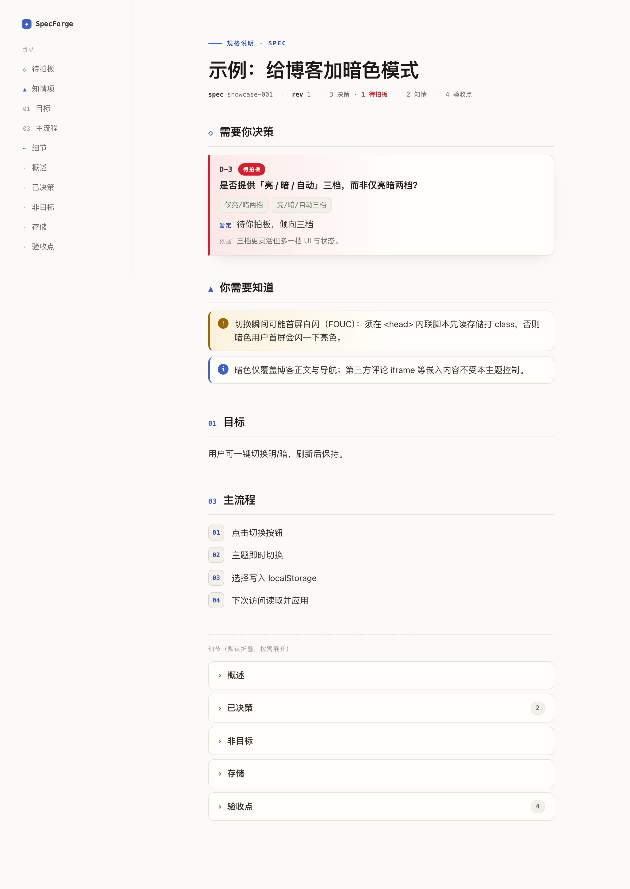

# SpecForge

[](https://github.com/WangLiquan/specforge/actions/workflows/ci.yml)
[](./LICENSE)

> 🔍 **在线看产物**（无需安装）：[落地页](https://wangliquan.github.io/specforge/) · [spec.html 示例](https://wangliquan.github.io/specforge/showcase.html)

更轻的「定义需求 → 验证实现」闭环，做成两个 skill：

- **`specforge-draft`** —— 把一个模糊 idea，经访谈 + 拷问，变成一份**单文件可视化的 `*.spec.html`**，让你用最小成本看懂「AI 要做什么」并拍板。
- **`specforge-verify`** —— 拿着这份 spec.html 逐条比对你的代码，**双出口**：把判定**回写进 spec.html**（每条 AC 标上 pass/partial/fail/na + `file:line` 证据 + 覆盖率条），同时在对话里给差距清单——看完顺手就修。

spec 不再是一坨 markdown，而是**人一眼能读、机器也能消费**的 HTML 产物；verify 后它还会变成「需求 + 验收状态」的活文档，后续打开就知道哪条做了哪条没做。

<p align="center">
  <a href="https://wangliquan.github.io/specforge/showcase.html"></a>
</p>
<p align="center"><sub><code>draft</code> 产出的 <code>spec.html</code>　·　点图看在线示例　·　<code>verify</code> 把判定回写进同一份 spec，并在对话里给差距清单</sub></p>

---

## 为什么是它

模型越强，多 skill 编排越显臃肿；人越依赖模型写码，markdown spec 对**人**的阅读成本反而越高。SpecForge 押注三件不可替代物：

1. **稳定的机器可读 JSON 契约** —— spec 内嵌一份结构化验收点清单，不只给人看，也能被工具消费/校验。
2. **不可信文本安全读取** —— verify 把 spec.html 当纯文本抽取、绝不执行，验得安全、可随手跑。
3. **严格判定纪律** —— 逐条比对落地产物，定位不到内容绝不判 pass，差距直接落到 `file:line`、给到你去修。

先打开 **[在线 spec 示例](https://wangliquan.github.io/specforge/showcase.html)** 看一份真实生成出的 spec 长什么样。

---

## 安装

两条通道任选其一，**命名空间隔离、可共存**：`npx skills` 装出 `/specforge-draft`，plugin 装出 `/specforge:specforge-draft`。

**方式 A：`npx skills`（skill 通道）**

```bash
npx skills add WangLiquan/specforge                  # 一次装上 draft + verify
npx skills add WangLiquan/specforge --skill specforge-draft   # 只装其一
npx skills add WangLiquan/specforge -g               # 装到全局(所有项目可用)
```

装完用 `npx skills list` 自检。

> 安装落点随 agent / scope 变化（symlink 或 copy）。Claude Code 的 global 链接当前在上游仍有已知 issue（vercel-labs/skills #851 / #744），如遇 `~/.claude/skills` 未生成，改用 project scope 或手动软链。

**方式 B：Claude Code plugin（plugin 通道）**

```bash
/plugin marketplace add WangLiquan/specforge          # 一次性：把本仓库注册成 marketplace
/plugin install specforge@specforge-marketplace       # 安装 specforge plugin（含 draft + verify）
```

> 本仓库根目录自带 `.claude-plugin/marketplace.json` + `plugin.json`，可被 Claude Code 原生 `/plugin` 机制直接消费。

**运行期要求**：你的机器需有 `node`（≥ 22）—— 两个 skill 会在本地调用自带脚本生成 HTML。脚本已 inline 全部依赖，**无需 `npm install`**。

## 更新

按你当初的安装通道选对应更新方式：

**方式 A：`npx skills`**

```bash
npx skills update            # 更新所有已装 skill（自动识别 project / global scope）
npx skills update -y         # 同上，非交互
npx skills update specforge-draft specforge-verify   # 只更新这两个
```

更新拉取的是仓库最新版；更新后需**新开会话**才会加载新版（Claude Code 在会话启动时载入 skill）。当初若用手动软链安装（非 `npx skills add`），则到本地 repo `git pull` 即可。

**方式 B：Claude Code plugin**

```bash
/plugin update specforge@specforge-marketplace        # 拉取仓库最新版
/reload-plugins                                        # 在当前会话激活新版（或直接新开会话）
```

---

## 怎么用

装好之后，直接在你的 AI 编码会话里用自然语言触发，不用记命令。

### 1. 用 `draft` 把需求理成 spec

对你的 agent 说类似：

> 「帮我写个给博客加暗色模式的 spec」 / 「draft a spec」 / 「把这个需求理成 spec」

它会：

1. **发散访谈**：一次一个问题，挖目标 / 非目标 / 约束 / 成功标准；
2. **收敛拷问**：对每个模糊的决策分支穷追到底，逼成明确选择；
3. **产出**：在你项目里生成 `specs/<日期>-<slug>.spec.html`。

双击打开就是一份可视化 spec：目标、流程、数据、以及带稳定编号（`AC-1 / AC-2 …`）的**验收点清单**。看着拍板，要改就继续对话、重新生成。

### 2. 写代码

照着 spec 实现。

### 3. 用 `verify` 验证实现

对你的 agent 说：

> 「对照 `xxx.spec.html` 检查代码」 / 「verify against spec」

它会**把 spec.html 当不可信文本读取**（绝不执行它），抽出验收点清单，逐条审你的代码，然后**双出口**：把每条判定**回写进源 spec.html**（标上 pass/partial/fail/na 徽标 + `file:line` 证据 + 顶部覆盖率条），同时在对话里给差距清单——看完顺手就修。（回写仅限 specforge-draft 自产的 spec；外部 spec 转纯对话清单。）

### 一个完整例子

```
你：帮我写个「给博客加暗色模式」的 spec
draft：（访谈+拷问几轮）→ 生成 specs/2026-06-03-blog-dark-mode.spec.html
你：（打开 HTML，确认 4 条验收点 AC-1..AC-4，OK）
你：（写代码：加切换按钮、切 class、写 localStorage…）
你：对照 specs/2026-06-03-blog-dark-mode.spec.html 检查代码
verify：→ 回写进 spec.html（AC-3 标红 fail + 覆盖率条）+ 对话差距清单
        覆盖率：pass 2 · partial 0 · fail 1 · na 1
        AC-3 [fail] 刷新后保留上次选择 —— 未见 localStorage 写入（验 src/theme.js:12）
```

一眼就知道还差哪一条，去补 `localStorage`；再打开 spec.html 就能看到 AC-3 已转绿。

---

## 产物长什么样

**`*.spec.html`（draft 产出）**

- **单个自包含文件**：CSS 全内联，双击即开，能直接发给别人评审；
- 内嵌一段 `<script type="application/json">` **数据岛**作为契约——这就是 verify 后续要逐条验的验收点清单；
- 生成时就把视图烤成静态 HTML、**无渲染期脚本**、CSP 严格，因此安全、可随手转发。

**verify 的双出口**

- **回写进源 spec.html**：每条 AC 标上 pass/partial/fail/na 徽标 + `file:line` 证据，顶部加覆盖率条，写入 `verifiedAt`——spec 从「需求」升级成「需求 + 验收状态」活文档，后续打开一眼看清哪条做了哪条没做（仅限 specforge-draft 自产 spec；外部 spec 转纯对话清单，不碰其文件）；
- **对话差距清单**：顶部一行覆盖率（pass / partial / fail / na），若结论都来自静态审查（没跑测试）会点明「未运行测试」，免得误读成"验证通过"；重点列 `fail` / `partial`，每条差在哪 + `file:line` 证据 + 该补什么；定位不到落地内容绝不判 pass；
- **不当 fixer**——回写改的是 spec 自身，不动被验代码；修复交常规编辑能力，改完可再验一遍重新回写覆盖旧判定。

---

## License

[MIT](./LICENSE) © 2026 WangLiquan

---

## Contributing

欢迎 issue / PR。本地开发：

```bash
npm install      # 装 dev 依赖
npm run check    # schema/bundle 一致性 + 全部测试(CI 同款)
```

> 注意：`skills/*/scripts/*.mjs` 与 `references/*.json` 是从 `lib/` 和 `schema/` 派生的产物。改了 `lib/` 或 `schema/` 后务必跑 `npm run build` 重新打包再提交，否则 CI 的一致性检查会拦住。
